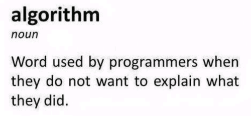

<!-- footer: "" -->

<style>
h1,h2,h3{
  transition: 1s;
}
h1:hover, h2:hover, h3:hover{
  color:#55a1f3;
  margin-left: 5%;
}
img[src*="notation.jpg"] {
  width: 45%;
  float: right;
  float: inline-end;
  margin: 0; 
  padding:0;
 }
 
</style>

# <!-- fit --> **Algorithms and Complexity**

### by Fabián Vega

---

<!-- footer: "Algorithms and Complexity by Fabián Vega" -->

# Table of Contents

1. [What is a Algorithm?](#what_is_a_algorithm)
2. [What is the Complxity of Algorithm?](#example2)
3. [The different asymptotic notations](#third-example)
4. [Fourth Example](#fourth-examplehttpwwwfourthexamplecom)
5. [Use the recursion as your ally]()
6. [How does program performance?]()

---

<style>
  img {
    margin-left: 25%;
  }
</style>

# What is a Algorithm?



> An algorithm is a set of instructions designed to perform a specific task.

---

# What is the Complxity of Algorithm?

It is defined as the amount of time and space required to solve a problem with size $n$.

- Time Complexity
- Space Complexity

---

# The different asymptotic notations

- **The Big Oh**
  

  It's said that a is $f(x) = O(g(x))$ if exists a $c > 0$ then $|f(x)| \leq c|g(x)|$ $(x\geq x_0)$

---

- **The Big Omega**
  

  It's said that a is $f(x) = \Omega(g(x))$ if exists a $c > 0$ then $|f(x)| \geq c|g(x)|$ $(x\geq x_0)$

---

- **The Big Theta**
  

  It's said that a is $f(x) = \Theta(g(x))$ if exists a $f(x) = O(g(x))$ and $f(x) = \Omega(g(x))$

---

## Other Notations

- **Little Oh**
  It's said that a is $f(x) = o(g(x))$ if $\lim_{x->\infty}{\frac{f(x)}{g(x)}} = 0$
- **Little Omega**
  It's said that a is $f(x) = \omega(g(x))$ if $\lim_{x->\infty}{\frac{f(x)}{g(x)}} \not= 0$
- **Landau Notation**
  It's said that a is $f(x) \sim g(x)$ if $\lim_{x->\infty}{\frac{f(x)}{g(x)}} = 1$

---

# <!-- fit --> **Break**

# <!-- fit --> This is the moment for doing all your questions :wink:

---

# A very brief introduction to algorithm design

---

# Use the recursion as your ally

The recursion is a very important tool in the design of algorithms. This allows us to split the problem into smaller problems that are easier to solve.

> "If the self-reference is confusing, it may be helpful to imagine that someone else is going to solve the simpler problems, just as you would assume for other types of reductions. I like to call that someone else the Recursion Fairy." Jeff Erickson

---

<style scoped>
  p:nth-child(4) {
    margin-left: 30%;
  }

</style>

## A basic example: Calculation of the factorial of a number

``` Haskell
let factorial = fn n::int -> int {
  if n <= 1 then{
    => 1;
  } else {
    => n * factorial(n-1);
  }
}
```

We can estimate the time complexity.
Let $T(1)=1$ and $T(n+1) = T(n) + 1$, if we expand it, obtained:

$T(1)=1$
$T(2)=T(1)+1=2$
$T(3)=T(2)+1=3$
...
$T(n) \Rightarrow O(n)$

---

## **The Metaheuristics "Divide And Conquer"**

### 1. Tower of Hanoi

> We has the goal to move all the disks from A to C with the help of B, but only one disk at a time without put a big disk on top o a small disk.

## 
---
<style scoped>
  p:nth-child(3) {
    margin-left: 30%;
  }

</style>
``` Haskell
let hanoi = fn n::int, src::str, tmp::str, dst::str -> int {
    if n > 0 then {
        hanoi(n-1, src, tmp, dst);
        printLn("Move disk " + to_string(n) + " from " + src + " to " + dst);
        hanoi(n-1, tmp, dst, src);
    }
}
```
We can estimate the time complexity.
Let $T(0)=0$ and $T(n+1) = 2T(n) + 1$, if we expand it, obtained:

$T(0)=0$
$T(1)=2T(0)+1=1$
$T(2)=2T(1)+1=3$
$T(3)=2T(2)+1=7$
...
$T(n)=2^n-1 \Rightarrow \Theta(2^n)$


---
### Mergesort
> We has the goal to sort an array of numbers. 
<!-- ``` Python
def mergesort(arr):
  if len(arr) > 1:
    mid1 = mergesort(arr[:n//2])
    mid2 = mergesort(arr[n//2:])
    return merge(mid1, mid2)
  return arr
``` -->
``` Haskell
let mergesort = fn arr::list -> list{
  let n = length(arr);
  if length(arr) > 1 then {
    let mid1 = mergesort(arr[0,floor(n/2)]);
    let mid2 = mergesort(arr[ceil(n/2),n]);
    => merge(mid1, mid2);
  }
  => arr;
}
```

Then the amount of work units are when $T(0) = T(1) = 1$ and $T(n) = T(\lfloor \frac{n}{2} \rfloor) +T(\lceil \frac{n}{2} \rceil) + m(\lfloor \frac{n}{2}\rfloor,  \lceil \frac{n}{2} \rceil)$. The complexity of Merge Sort is $O(n\log{n})$.
> This is not demonstrable with the that we have, for this we must use the Master Theorem.

---

### Backtracking


---

### Branch and Bound

---

# How does program performance?

## The basic principles

- Sequence of actions
- Alternation
- Cycles
- Procedure calls

---

References:

1. [Algorithms and Complexities](https://www.tutorialspoint.com/Algorithms-and-Complexities)
2. [Analysis of algorithems little o and little omega notations](https://www.geeksforgeeks.org/analysis-of-algorithems-little-o-and-little-omega-notations/)
3. [Recursion](https://jeffe.cs.illinois.edu/teaching/algorithms/book/01-recursion.pdf)
4. [A star](https://www.redblobgames.com/pathfinding/a-star/introduction.html)
5. [Merge sort animation](https://www.youtube.com/watch?v=JSceec-wEyw)
