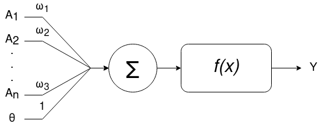
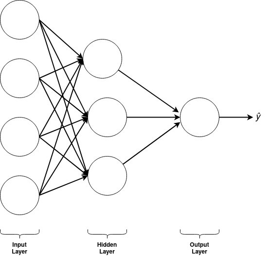

# Qué son las redes neuronales artificiales

En pocas palabras las redes neuronales o neuronal networks (NN) son un modelo matematico y computacional que imita el comportamiento de las redes que forman nuestras neuronas.

## El perceptron
Sus unidades más basica se llaman **perceptron** que se componen de la siguiente estructura.

Donde los *A1*, *A2*, hasta *An* son los valores de entrada, *w1*, *w2*, hasta *wn* los pesos sinapticos y *O* el sesgo, todo esto se suma y luego se evalua en la función de activación *f(x)*.

Matematicamente se representa de esta manera:

Existen muchas funciones de activación diferentes, algunos ejemplos son:

## Estructura de un NN

Las redes neuronales tipicamente se organizan en capas (_layers_ en inglés), donde cada capa tiene un cierto numero de neuronas que se conecta con cada una de las sigientes neuronas en la capa que le sigue, de esta manera:

Como se puede ver existe una capa de entrada, ninguna o varias capas ocultas (en cuyo caso de no haber ninguna entonces se le llama de single layer, de otra forma se le llama de multi layer) y una de salida.

## Cómo puede aprender una NN

Para un proceso de aprendisaje supevisado, todo comienza con el algoritmo de **`Forward propagation`** que se encarga de calcular una prediccion con las entradas dadas, a esta prediccion se le calcula el error. Este error luego es usado por el algoritmo de **`Back Propagation`** para corregir los pesos sinapticos, este proceso viene acompañado de otro algoritmo más, llamado **`Gradient decent`**. Para entender mejor esto, imagina que estas en la cima de una montaña y quieres bajar al lugar más bajo de este terreno, pero por extrañas circuntancias estas con los ojos vendados.

**¿Cómo puedes lograr este objetivo?**

Una respuesta es a traves de la inclinación del terreno, esto precisamente es lo que hace este algoritmo, mide cuan inclinado esta el terreno mediante su gradiente, que si no sabes e gradiente en matematicas esta dado por un vector con las deribadas de una funcion. Y sigue la mayor inclinación. Esto permite que la red pueda ir disminuyendo el error, hasta lograr tener buenas predicciones.

A este proceso se le llama **aprendizaje**.

## Cómo entreno una red

Para esto debes tener en cuenta varias cosas como que cual es su configuracion, cantidad de neuronas, de layers, las funciones de activacion, etc. Y tambien de los datos con que entrenamos la red.

### Hiperparametros

Estasson las configuraciones que le damos a la red para que comience a aprender, por ejemplo, el `learning rate` (en pocas palabras "el tamaño de los pasos de al bajar por el terreno"), la cantidad de neuronas por layer, la cantidade de hidden layers o las funciones de activacion que se usaran.

De esto depende que tan bien aprenda la red.

### Conjunto de datos.

Para todo algoritmo de _`Machine Learning`_, los datos son una parte importante de que tan bien resulte todo, por lo que tmabien se debe g¿hacer una limpieza de los datos, si es necesario, normalizarlos y tambien separarlos en conjuntos, tipicamente en conjuntos de _train_, _dev_ y _test_. donde la distribucion de estos depende del conjunto de datos que tengamos.

