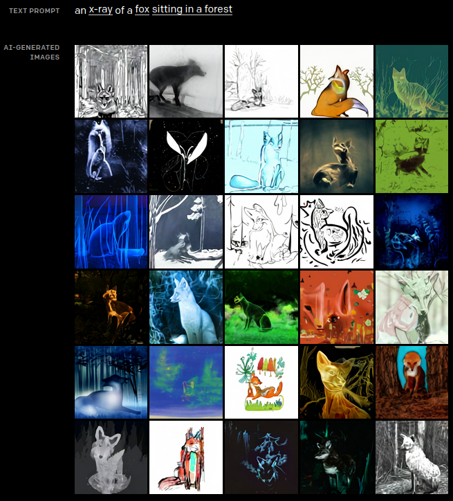

# El ciclo de la automatización

Hace solo una semana, una noticia encendio las alarmas en el mundo de la programación, una nueva herramienta traida por **OpenAI** capaz de crear codigo apartir de comentarios y autocompletar lo que escribes. Esto basto para que muchos anunciaran el fin de los programadores.

Pero ¿Es acaso esto un fenomeno nuevo? Pues no, esto sucedio antentes con cada nueva tecnología, los carteros por ejemplo, ya no necesitamos una persona que recorra kilometros para que nuestro mensaje llegue a otra persona, sino simplemnte enviamos un mensaje o un correo electronico e incluso muchos trabajos en las fabricas han sido ocupados por robots automatizados.

Hasta ahora con todo esto sobre la mesa, pareciera que la automatización, la robotica y el desarrollo de la tecnología en si, es ola maligna que viene a destruir nuestras oportunidades y trabajos, y tal vez sea así en el sentido de que podra quitarnos nuestros trabajos, en especial todo lo que se convierta en un trabajo repetitivo, pues es exactamente eso lo que mejor hace una maquina.

## ¿Hay algo en que no sea buena una maquina?

Hasta el momento, hemos logrado crear comuptadores capaces de hacer calculos tremendamente precisos y inteligencias artificiales capaces de muchisimas cosas, como **[GPT-3](https://arxiv.org/abs/2005.14165)** una AI capaz de procesar y escribir texto, o **[DALL-E](https://openai.com/blog/dall-e/)** capaz de crear imagenes a partir de una oracion.

Pareciera que estas maquinas no tienen falencias, pero hasta el momento son tremendamente dependientes, necesitan cantidades ingentes de datos, capacidades de computo tremendos y personas muy capaces para que las creen y entrenen. 

